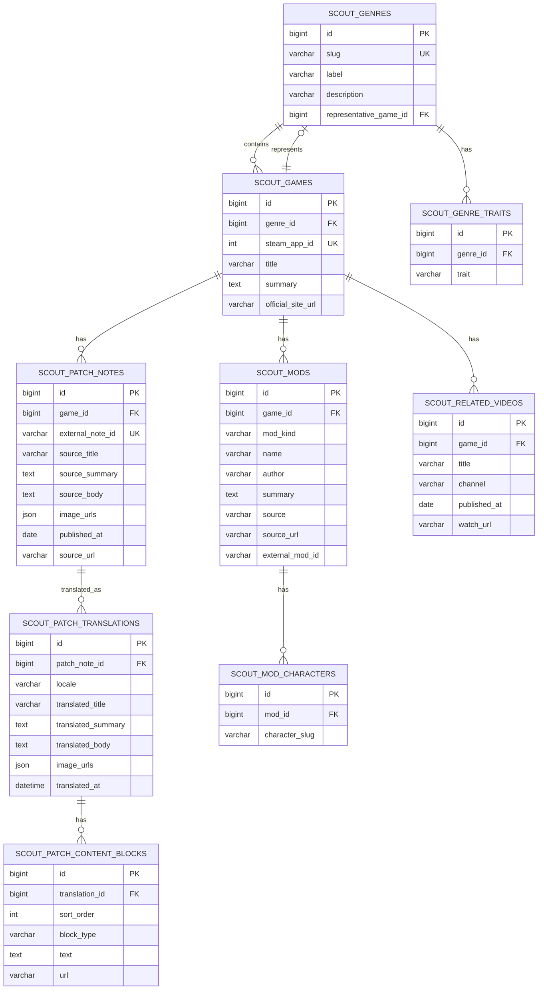

# Scout ERD

Mermaid `erDiagram`은 속성·관계 라벨의 **따옴표·괄호·슬래시** 등에서 파싱 오류가 납니다. 필드 설명은 아래 표를 참고하세요.

이 문서는 Scout 도메인의 **3NF 기준 DB 저장 모델 초안**입니다. 현재 런타임 DTO와 달리, **원문 패치**와 **번역 패치**를 분리해 표현합니다.

## 관계

| 관계                                                    | 설명                                          |
| ----------------------------------------------------- | ------------------------------------------- |
| SCOUT_GENRES → SCOUT_GAMES                            | 1:N, 장르에 속한 게임 목록                           |
| SCOUT_GENRES → SCOUT_GENRE_TRAITS                     | 1:N, 장르 특징 태그                               |
| SCOUT_GAMES → SCOUT_GENRES                            | 0..1:1, 대표 게임 참조 (`representative_game_id`) |
| SCOUT_GAMES → SCOUT_PATCH_NOTES                       | 1:N, 원문 패치 노트                               |
| SCOUT_PATCH_NOTES → SCOUT_PATCH_TRANSLATIONS          | 1:N, 로케일별 번역                                |
| SCOUT_PATCH_TRANSLATIONS → SCOUT_PATCH_CONTENT_BLOCKS | 1:N, 번역 본문의 순서 보존 블록                        |
| SCOUT_GAMES → SCOUT_MODS                              | 1:N, 게임별 모드 메타 (`mod_kind`으로 외형/기능 구분)      |
| SCOUT_MODS → SCOUT_MOD_CHARACTERS                     | 1:N, 모드가 대상으로 하는 캐릭터 목록                     |
| SCOUT_GAMES → SCOUT_RELATED_VIDEOS                    | 1:N, 게임별 관련 영상 메타                           |

## 필드 설명

| 엔티티                        | 필드                     | 설명                                                                            |
| -------------------------- | ---------------------- | :---------------------------------------------------------------------------- |
| SCOUT_GENRES               | slug                   | 장르 슬러그 (`soulslike`, `roguelike`, `openworld`, `metroidvania`)                |
| SCOUT_GENRES               | label                  | 화면 표시명                                                                        |
| SCOUT_GENRES               | description            | 장르 설명                                                                         |
| SCOUT_GENRES               | representative_game_id | 대표 게임 FK (`SCOUT_GAMES.id`) — 런타임은 현재 `representative_title` 문자열 사용           |
| SCOUT_GAMES                | genre_id               | SCOUT_GENRES.id 참조                                                            |
| SCOUT_GAMES                | steam_app_id           | Steam 앱 ID (Nexus 도메인·URL 파생의 기준)                                             |
| SCOUT_GAMES                | title                  | 게임 제목                                                                         |
| SCOUT_GAMES                | summary                | 게임 소개                                                                         |
| SCOUT_GAMES                | official_site_url      | 공식 사이트 URL (`steam_store_url`은 `steam_app_id`에서 파생, 비저장)                      |
| SCOUT_GENRE_TRAITS         | genre_id               | SCOUT_GENRES.id 참조                                                            |
| SCOUT_GENRE_TRAITS         | trait                  | 장르 특징 태그                                                                      |
| SCOUT_PATCH_NOTES          | game_id                | SCOUT_GAMES.id 참조                                                             |
| SCOUT_PATCH_NOTES          | external_note_id       | 외부 패치 식별자 (Steam: `{steam_app_id}-steam-{gid}`)                               |
| SCOUT_PATCH_NOTES          | source_title           | 원문 제목                                                                         |
| SCOUT_PATCH_NOTES          | source_summary         | 원문 목록 요약 (최대 220자 발췌)                                                         |
| SCOUT_PATCH_NOTES          | source_body            | 원문 전문 (영문, BBCode → plain text 변환 후)                                          |
| SCOUT_PATCH_NOTES          | image_urls             | 원문 이미지 URL 목록 (JSON 배열, Steam CDN 정규화 후)                                      |
| SCOUT_PATCH_NOTES          | published_at           | 공개일                                                                           |
| SCOUT_PATCH_NOTES          | source_url             | 원문 URL (Steam 커뮤니티 공지)                                                        |
| SCOUT_PATCH_TRANSLATIONS   | patch_note_id          | SCOUT_PATCH_NOTES.id 참조                                                       |
| SCOUT_PATCH_TRANSLATIONS   | locale                 | 번역 로케일 (`ko-KR` 등)                                                            |
| SCOUT_PATCH_TRANSLATIONS   | translated_title       | 번역 제목                                                                         |
| SCOUT_PATCH_TRANSLATIONS   | translated_summary     | 번역 요약                                                                         |
| SCOUT_PATCH_TRANSLATIONS   | translated_body        | 번역 전문 (한국어, `body_ko` 대응)                                                     |
| SCOUT_PATCH_TRANSLATIONS   | image_urls             | 번역 버전 이미지 URL 목록 (JSON 배열, 원문과 동일 이미지 참조)                                     |
| SCOUT_PATCH_TRANSLATIONS   | translated_at          | 번역 시각                                                                         |
| SCOUT_PATCH_CONTENT_BLOCKS | translation_id         | SCOUT_PATCH_TRANSLATIONS.id 참조                                                |
| SCOUT_PATCH_CONTENT_BLOCKS | sort_order             | 블록 순서 (원문 내 텍스트·이미지 인터리빙 순서 보존)                                               |
| SCOUT_PATCH_CONTENT_BLOCKS | block_type             | `text` 또는 `image`                                                             |
| SCOUT_PATCH_CONTENT_BLOCKS | text                   | 텍스트 블록 본문 (block_type=text 일 때)                                               |
| SCOUT_PATCH_CONTENT_BLOCKS | url                    | 이미지 URL (block_type=image 일 때)                                                |
| SCOUT_MODS                 | game_id                | SCOUT_GAMES.id 참조                                                             |
| SCOUT_MODS                 | mod_kind               | `appearance`(외형) 또는 `functional`(기능)                                          |
| SCOUT_MODS                 | name                   | 모드 이름                                                                         |
| SCOUT_MODS                 | author                 | 모드 작성자                                                                        |
| SCOUT_MODS                 | summary                | 모드 설명                                                                         |
| SCOUT_MODS                 | source                 | 수집 출처 (`nexus`, `workshop`, `curated`, `github`)                              |
| SCOUT_MODS                 | source_url             | 모드 페이지 URL                                                                    |
| SCOUT_MODS                 | external_mod_id        | 외부 모드 식별자 (Nexus mod id, Workshop file id 등)                                  |
| SCOUT_MOD_CHARACTERS       | mod_id                 | SCOUT_MODS.id 참조                                                              |
| SCOUT_MOD_CHARACTERS       | character_slug         | 대상 캐릭터 슬러그 (`regent`, `silent`, `ironclad`, `defect`, `necrobinder`, `other`) |
| SCOUT_RELATED_VIDEOS       | game_id                | SCOUT_GAMES.id 참조                                                             |
| SCOUT_RELATED_VIDEOS       | title                  | 영상 제목                                                                         |
| SCOUT_RELATED_VIDEOS       | channel                | 채널명                                                                           |
| SCOUT_RELATED_VIDEOS       | published_at           | 공개일                                                                           |
| SCOUT_RELATED_VIDEOS       | watch_url              | 시청 URL                                                                        |

## 정규화 메모

| 항목                  | 설명                                                                                                      |
| ------------------- | --------------------------------------------------------------------------------------------------------- |
| 대표 타이틀              | 런타임은 `GenreHubDto.representative_title` 문자열 사용 중 — DB 마이그레이션 시 `representative_game_id` FK로 전환 예정      |
| 패치 원문/번역 분리         | `SCOUT_PATCH_NOTES`는 원문(영문), `SCOUT_PATCH_TRANSLATIONS`는 번역만 저장                                         |
| 콘텐츠 블록 분리           | `SCOUT_PATCH_CONTENT_BLOCKS`는 번역 본문의 텍스트·이미지 인터리빙 순서를 `sort_order`로 보존                                 |
| image_urls 저장 방식    | 원문·번역 모두 `json` 컬럼으로 URL 배열 저장 (이미지 URL 순서가 content_blocks와 일치해야 함)                                    |
| 자연키 처리              | `steam_app_id`, `external_note_id`는 `UNIQUE` 후보 — 내부 PK는 `id` 사용                                        |
| 중복 방지 권장            | `SCOUT_GENRE_TRAITS (genre_id, trait)`, `SCOUT_PATCH_TRANSLATIONS (patch_note_id, locale)`, `SCOUT_MOD_CHARACTERS (mod_id, character_slug)` |
| 모드 캐릭터 분리           | `ModDto.characters: list[str]`는 다중값 — `SCOUT_MOD_CHARACTERS` 접합 테이블로 3NF 보장                            |
| 모드 외형/기능 분리         | `SCOUT_MODS.mod_kind` — 키워드 휴리스틱(`mod_kind_rules.py`)으로 자동 분류                                           |
| 모드 분류 기준            | 외형: 스킨·카드아트·보이스 / 기능: 캐릭터·밸런스·QoL·멀티·프레임워크 (목록 제외 권장)                                               |
| steam_store_url 비저장 | `https://store.steampowered.com/app/{steam_app_id}` — `steam_app_id`에서 파생이므로 DB 저장 불필요                  |

## 현재 구현 상태 (DB 미연동)

| 데이터           | 현재 어댑터                                                                              | 비고                                       |
| ------------- | ----------------------------------------------------------------------------------- | ---------------------------------------- |
| 장르·게임 목록      | 정적 리포지터리 (`*_static_repository.py`)                                                 | `SoulslikeStaticRepository` 등 4개 장르      |
| 패치 노트 원문      | Steam ISteamNews API (`SteamNewsHttpRepository`)                                    | BBCode → 블록 파싱, 이미지 URL 정규화              |
| 패치 노트 번역      | Gemini API (`GeminiPatchNoteTranslator`) + 파일 캐시 (`PatchTranslationFileRepository`) | `data/patch_translations/{note_id}.json` |
| 모드 (Nexus)    | Nexus HTTP (`NexusModHttpRepository`)                                               | game_domain_name으로 조회                    |
| 모드 (Workshop) | Workshop HTTP (`WorkshopModHttpRepository`)                                         | Steam Workshop API                       |
| 모드 (큐레이션 외형)  | 정적 목록 (`curated_appearance_mods.py`)                                                | STS2 기준 수동 큐레이션                          |
| 영상            | `GameDetailStaticRepository` fallback                                               | YouTube 검색 링크로 임시 대체                     |

## API 응답 초안 (게임 상세)

런타임 `GameDetailDto`는 DB `SCOUT_MODS`를 `mod_kind` 기준으로 나눠 내려주고, `ModDto.characters`로 대상 캐릭터를 명시한다.

| JSON 필드            | `mod_kind`    | `characters` 예시                         |
| ------------------- | ------------- | ----------------------------------------- |
| `appearanceMods`   | `appearance`  | `["regent"]`, `["ironclad", "silent"]`    |
| `functionalMods`   | `functional`  | `["other"]` (캐릭터 무관 기능 모드)            |

`PatchNoteDto.contentBlocks`는 `SCOUT_PATCH_CONTENT_BLOCKS`의 런타임 표현으로, `sort_order` 순 텍스트·이미지 블록을 교대로 내려준다.
